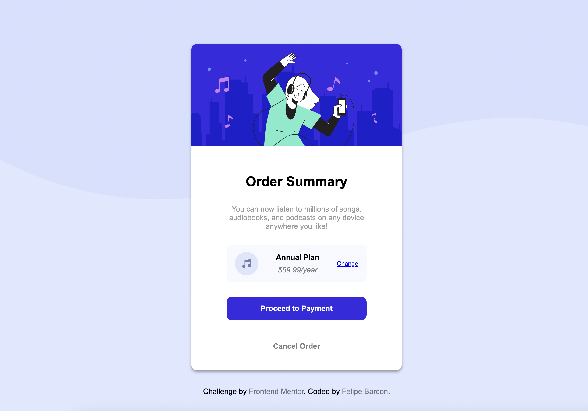

# Frontend Mentor - Order summary card solution

This is a solution to the [Order summary card challenge on Frontend Mentor](https://www.frontendmentor.io/challenges/order-summary-component-QlPmajDUj). Frontend Mentor challenges help you improve your coding skills by building realistic projects.

## Table of contents

- [Overview](#overview)
  - [Screenshot](#screenshot)
  - [Links](#links)
- [Author](#author)

### Screenshot

### Links

- Live Site URL: [Add live site URL here](https://order-summary-component-main-felipe.netlify.app/)

## Author

- Linkedin - [Felipe Barcon](https://www.linkedin.com/in/felipe-barcon/)
- Frontend Mentor - [Felipebarcon](https://www.frontendmentor.io/profile/Felipebarcon)

**Note: Delete this note and add/remove/edit lines above based on what links you'd like to share.**
